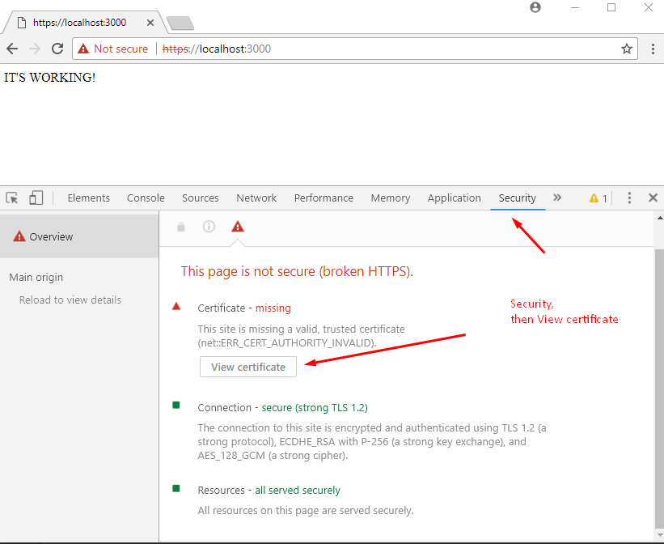
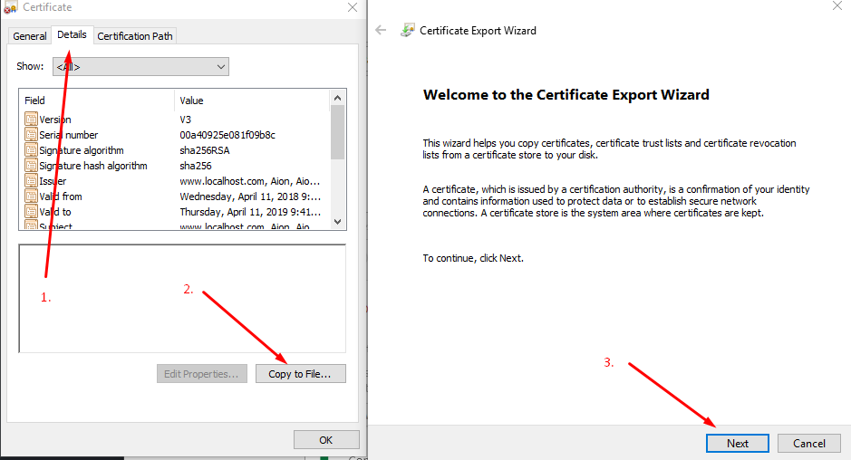
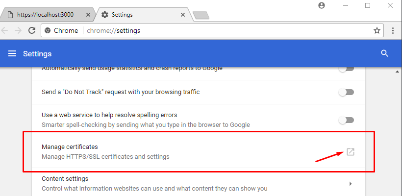
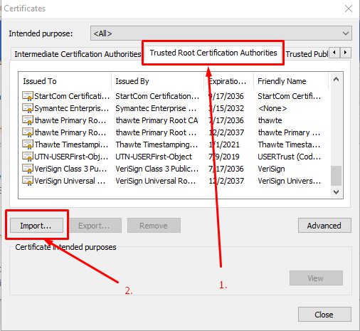

# Google Drive Clone - JS Expert 5.0

## Preview


<br>

## Features Checklist

- Web API
    - [x] List downloaded files
    - [] Receive file's stream and save it on disk
    - [] Notify storage stream progress of files being transfered to disk
    - [] Allowed formats: images, videos or audios
    - [] Must have 100% code coverage

- Web App 
    - [] List downloaded files
    - [] Allow any file size
    - [] Upload function via button
    - [] Show upload progress bar
    - [] Upload via drag and drop

<br>

## Post-Project Challenges

1. *Backend*: Save the project at AWS or any other storage service
     - Upload files to the cloud using Stream
     - 100% code coverage of the new feature
2. *Frontend*: Add front-end tests to reach 100% code coverage
    - Using Jest, you must do the same process used in the back-end to run tests
    - [Example of this challenge](https://github.com/ErickWendel/tdd-frontend-example)
3. *Infrastructure*: Publish your application with your custom SSL in a Virtual Machine
    - Using *Let's Encrypt* generate a SSL to your Virtual Machine and add it to your application

<br>

## Layout Credits <3 

- The layout was adapted from the project developed by the Brazilian [Leonardo Santo](https://github.com/leoespsanto) available at [codepen](https://codepen.io/leoespsanto/pen/KZMMKG). 

<br>

## FAQ 
- `NODE_OPTIONS` not working in Windows?
    - You must enter `set` before the command.
    - e. g. `"test": "set NODE_OPTIONS=--experimental-vm-modules && npx jest --runInBand",`

<br>

- `npm test` not working?
    - Check your NodeJS version. This project runs with the version 16.8. Download it at [NodeJS's website](https://nodejs.org).

<br>

- Invalid SSL Certificate? (Linux's Users)
    - Install MKCert
    - Make your user as a valid user for the certificate running the command: `mkcert -install`
    - Generate the Key and Cert files running the command: `mkcert -key-file key.pem -cert-file cert.pem 0.0.0.0 localhost 127.0.0.1 ::1`

<br>

- Invalid SSL Certificate? (Windows's Users) (Credits: [Aion](https://stackoverflow.com/users/5904566/aion))
    - Install [OpenSLL](https://slproweb.com/products/Win32OpenSSL.html)
    - Make a file named `req.cnf` at `C:\Program Files\OpenSSL-Win64\bin` folder with the following content: (Credits: [Anshul](https://stackoverflow.com/users/1768910/anshul ))
```
    [req]
    distinguished_name = req_distinguished_name
    x509_extensions = v3_req
    prompt = no
    [req_distinguished_name]
    C = Country initials like US, RO, GE, BR
    ST = State
    L = Location
    O = Organization Name
    OU = Organizational Unit 
    CN = www.localhost.com
    [v3_req]
    keyUsage = critical, digitalSignature, keyAgreement
    extendedKeyUsage = serverAuth
    subjectAltName = @alt_names
    [alt_names]
    DNS.1 = www.localhost.com
    DNS.2 = localhost.com
    DNS.3 = localhost
```

<br>

-
    - Run as Admin the file `openssl.exe` from the folder `C:\Program Files\OpenSSL-Win64`
    - Type: `req -x509 -nodes -days 365 -newkey rsa:2048 -keyout cert.key -out cert.pem -config req.cnf -sha256`
    - Copy the files `cert.key` and `cert.pem` from the folder `C:\Program Files\OpenSSL-Win64\bin` to your project's folder
    - Now follow the steps from the images below:

<br>

<br>
<br>
<br>
<br>
<br>
<br>
<br>